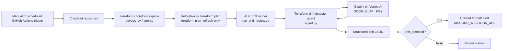
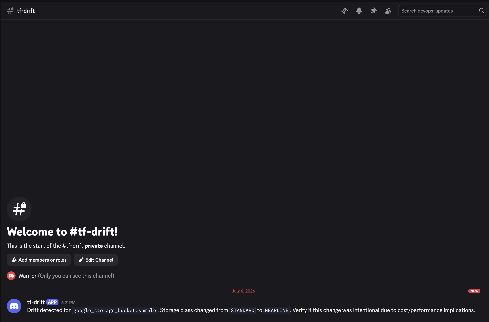

# Terraform Drift Detector ADK Agent

Reviews Terraform Cloud refresh-only plan output and reports whether remote
infrastructure has drifted from Terraform state/configuration.

## What It Does

This agent checks the Terraform Cloud workspace for drift by running a
refresh-only plan. The plan output is sent to a Gemini ADK agent, which returns
structured JSON:

```json
{
  "drift_detected": true,
  "findings": ["storage-class-drift"],
  "evidence": [
    "google_storage_bucket.sample: Drift detected (update)",
    "~ storage_class               = \"STANDARD\" -> \"NEARLINE\""
  ],
  "severity": "medium",
  "discord_message": "Drift detected for `google_storage_bucket.sample`. Storage class changed from `STANDARD` to `NEARLINE`. Verify if this change was intentional due to cost/performance implications."
}
```

When `drift_detected` is `true`, the workflow can post `discord_message` to the
Discord webhook configured in GitHub Secrets.

## Flow

```text
GitHub Actions
  -> Terraform Cloud refresh-only plan
  -> ADK drift detector
  -> Gemini on Vertex AI using GOOGLE_API_KEY
  -> JSON drift review
  -> Discord message only when drift_detected == true
```

## Architecture



## Files

```text
agents/adk/terraform-drift-detector/agent.py
agents/adk/terraform-drift-detector/run_drift_review.py
agents/adk/terraform-drift-detector/requirements.txt
```

Terraform configuration reviewed by the workflow:

```text
agents/adk/terraform-plan-reviewer/terraform/gcs-sample
```

## GitHub Actions Workflow

An example workflow can be named:

```text
Terraform Drift Detector
```

It runs manually and on a schedule:

```yaml
workflow_dispatch:
schedule:
  - cron: "0 */6 * * *"
```

Core commands:

```bash
terraform plan -refresh-only -detailed-exitcode -no-color
python run_drift_review.py < drift-plan.txt
```

Terraform exit code handling:

```text
0 = no drift
1 = Terraform error
2 = drift detected / non-empty diff
```

The workflow does not fail on exit code `2`; it lets the ADK agent classify and
notify.

## Required Secrets

Store these in the repo that runs the workflow under:

```text
Settings -> Secrets and variables -> Actions
```

```text
GOOGLE_API_KEY        Vertex account-bound API key used by the ADK agent
TFC_TOKEN             Terraform Cloud API token
DISCORD_WEBHOOK_URL   Discord webhook for drift alerts
```

The Discord webhook is not committed to the repo. The workflow reads it with:

```yaml
DISCORD_WEBHOOK_URL: ${{ secrets.DISCORD_WEBHOOK_URL }}
```

## Terraform Cloud Target

```text
organization: devops_vv
workspace: agents
```

The current sample watches:

```text
google_storage_bucket.sample
```

## Tested Result

Test run:

```text
Terraform Drift Detector #28829971789
```

Terraform Cloud detected this drift:

```text
google_storage_bucket.sample: Drift detected (update)
~ storage_class = "STANDARD" -> "NEARLINE"
```

The ADK agent returned:

```json
{
  "drift_detected": true,
  "findings": ["storage-class-drift"],
  "severity": "medium"
}
```

Discord received:

```text
Drift detected for `google_storage_bucket.sample`. Storage class changed from `STANDARD` to `NEARLINE`. Verify if this change was intentional due to cost/performance implications.
```

Screenshot of the Discord alert:



## Local Test

Install dependencies:

```bash
python -m pip install -r requirements.txt
```

Run the agent against saved refresh-only plan output:

```bash
python run_drift_review.py < drift-plan.txt
```

## Operational Note

Use Terraform Cloud dynamic credentials with Google Cloud Workload Identity
Federation for scheduled drift detection. See
[Terraform Cloud to Google Cloud Workload Identity Setup](TERRAFORM_CLOUD_GCP_WORKLOAD_IDENTITY.md).
