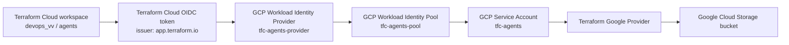

# Terraform Cloud to Google Cloud Workload Identity Setup

This guide configures HCP Terraform / Terraform Cloud to authenticate to Google
Cloud without service account JSON keys or manually refreshed OAuth tokens.

The setup is for the Terraform Cloud workspace:

```text
organization: devops_vv
workspace: agents
```

and the Google Cloud project:

```text
project_id: project-a0cc461d-29e7-4537-885
project_number: 128015056831
```

## What This Solves

Do not use this for scheduled drift detection:

```text
GOOGLE_OAUTH_ACCESS_TOKEN
```

That token expires and causes Terraform Cloud runs to fail with `401 Invalid
Credentials`.

Instead, use Workload Identity Federation:

```text
Terraform Cloud run
  -> OIDC token from app.terraform.io
  -> Google Workload Identity Pool Provider
  -> impersonated Google service account
  -> short-lived credentials for the Terraform Google provider
```

## Architecture



## Required APIs

Enable these Google Cloud APIs:

```bash
gcloud services enable iam.googleapis.com iamcredentials.googleapis.com sts.googleapis.com \
  --project=project-a0cc461d-29e7-4537-885 \
  --quiet
```

## Create the Workload Identity Pool

```bash
gcloud iam workload-identity-pools create tfc-agents-pool \
  --location=global \
  --display-name="TFC agents pool" \
  --description="HCP Terraform dynamic credentials for devops_vv/agents workspace" \
  --project=project-a0cc461d-29e7-4537-885 \
  --quiet
```

## Create the OIDC Provider

The provider trusts OIDC tokens from Terraform Cloud and restricts them to the
`devops_vv/agents` workspace.

```bash
gcloud iam workload-identity-pools providers create-oidc tfc-agents-provider \
  --location=global \
  --workload-identity-pool=tfc-agents-pool \
  --display-name="TFC agents provider" \
  --description="OIDC provider for HCP Terraform devops_vv/agents" \
  --issuer-uri="https://app.terraform.io" \
  --attribute-mapping="google.subject=assertion.sub,attribute.terraform_organization_id=assertion.terraform_organization_id,attribute.terraform_workspace_id=assertion.terraform_workspace_id,attribute.terraform_run_phase=assertion.terraform_run_phase" \
  --attribute-condition="assertion.sub.startsWith(\"organization:devops_vv:project:\") && assertion.sub.contains(\":workspace:agents:\")" \
  --project=project-a0cc461d-29e7-4537-885 \
  --quiet
```

## Create the Service Account

```bash
gcloud iam service-accounts create tfc-agents \
  --display-name="Terraform Cloud agents workspace" \
  --description="Service account impersonated by HCP Terraform devops_vv/agents via Workload Identity Federation" \
  --project=project-a0cc461d-29e7-4537-885 \
  --quiet
```

Service account email:

```text
tfc-agents@project-a0cc461d-29e7-4537-885.iam.gserviceaccount.com
```

## Grant Google Cloud Resource Permissions

For the sample GCS workflow, grant Storage Admin to the service account:

```bash
gcloud projects add-iam-policy-binding project-a0cc461d-29e7-4537-885 \
  --member="serviceAccount:tfc-agents@project-a0cc461d-29e7-4537-885.iam.gserviceaccount.com" \
  --role="roles/storage.admin" \
  --condition=None \
  --quiet
```

For production, replace `roles/storage.admin` with the smallest custom or
predefined role that can manage only the resources this workspace owns.

## Allow Terraform Cloud to Impersonate the Service Account

Grant the Workload Identity principal set access to impersonate the service
account:

```bash
gcloud iam service-accounts add-iam-policy-binding \
  tfc-agents@project-a0cc461d-29e7-4537-885.iam.gserviceaccount.com \
  --member="principalSet://iam.googleapis.com/projects/128015056831/locations/global/workloadIdentityPools/tfc-agents-pool/*" \
  --role="roles/iam.workloadIdentityUser" \
  --project=project-a0cc461d-29e7-4537-885 \
  --quiet
```

Also grant Token Creator. Without this, Terraform Cloud can reach the pool but
fails when the provider asks Google Cloud for an access token:

```text
Permission 'iam.serviceAccounts.getAccessToken' denied
```

Fix:

```bash
gcloud iam service-accounts add-iam-policy-binding \
  tfc-agents@project-a0cc461d-29e7-4537-885.iam.gserviceaccount.com \
  --member="principalSet://iam.googleapis.com/projects/128015056831/locations/global/workloadIdentityPools/tfc-agents-pool/*" \
  --role="roles/iam.serviceAccountTokenCreator" \
  --project=project-a0cc461d-29e7-4537-885 \
  --quiet
```

## Configure Terraform Cloud Workspace Variables

In Terraform Cloud, set these as workspace environment variables:

```text
TFC_GCP_PROVIDER_AUTH=true
TFC_GCP_PRINCIPAL_TYPE=service_account
TFC_GCP_WORKLOAD_PROVIDER_NAME=projects/128015056831/locations/global/workloadIdentityPools/tfc-agents-pool/providers/tfc-agents-provider
TFC_GCP_RUN_SERVICE_ACCOUNT_EMAIL=tfc-agents@project-a0cc461d-29e7-4537-885.iam.gserviceaccount.com
```

Remove any static or short-lived Google credential variables that can override
dynamic credentials:

```text
GOOGLE_OAUTH_ACCESS_TOKEN
GOOGLE_CREDENTIALS
GOOGLE_APPLICATION_CREDENTIALS
```

## Provider Configuration

The Terraform Google provider should not set explicit credentials. It should
only set normal provider options such as project and region:

```hcl
provider "google" {
  project = var.project_id
  region  = var.region
}
```

## Verify the Setup

Run a Terraform Cloud refresh-only plan:

```bash
terraform init -input=false
terraform plan -refresh-only -detailed-exitcode -input=false -no-color
```

Expected exit codes:

```text
0 = refresh succeeded and no drift
1 = Terraform error
2 = refresh succeeded and drift was detected
```

The tested setup returned exit code `2` because the sample bucket had expected
drift:

```text
google_storage_bucket.sample: Drift detected (update)
~ storage_class = "STANDARD" -> "NEARLINE"
```

Terraform Cloud run:

```text
https://app.terraform.io/app/devops_vv/agents/runs/run-CQjT2LriMMKFrmj3
```

## Troubleshooting

### 401 Invalid Credentials

Terraform Cloud is still using an expired static token.

Check for and remove:

```text
GOOGLE_OAUTH_ACCESS_TOKEN
```

### iam.serviceAccounts.getAccessToken denied

The Workload Identity principal can authenticate, but cannot mint an access
token for the service account.

Grant:

```text
roles/iam.serviceAccountTokenCreator
```

on the target service account to:

```text
principalSet://iam.googleapis.com/projects/128015056831/locations/global/workloadIdentityPools/tfc-agents-pool/*
```

### Provider Still Uses Static Credentials

Make sure the workspace does not have:

```text
GOOGLE_CREDENTIALS
GOOGLE_APPLICATION_CREDENTIALS
```

HashiCorp notes that these conflict with dynamic credentials for the GCP
provider.

## Security Notes

- Prefer Workload Identity Federation over service account JSON keys.
- Restrict the provider with an attribute condition for the exact Terraform
  Cloud organization and workspace.
- Grant the service account only the permissions required by the Terraform
  workspace.
- Use separate service accounts for plan/apply if production requires stricter
  separation.
- Do not commit Terraform Cloud tokens, Discord webhooks, service account keys,
  or Google API keys.

