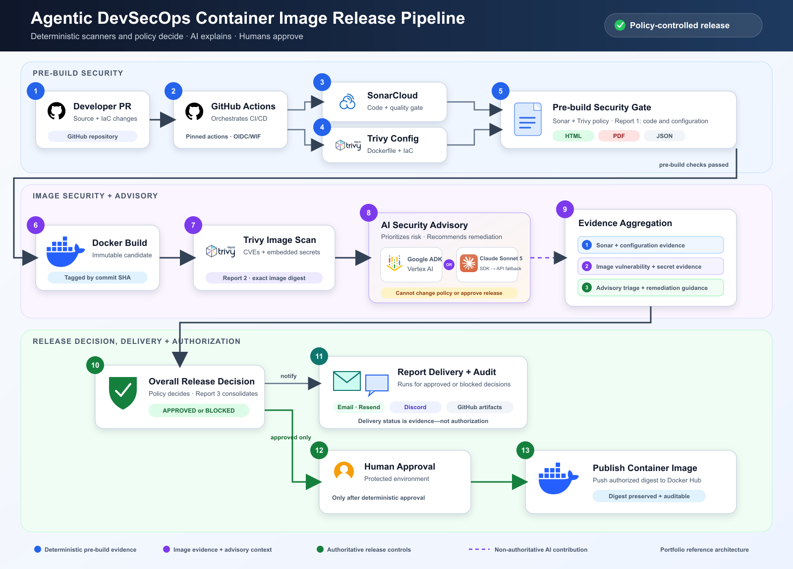

# Container Image Release Advisor

A policy-driven DevSecOps reference that builds a real container image, scans
code and configuration before the build, scans the exact image after the build,
uses one bounded AI advisor to triage scanner evidence, and publishes only after
deterministic policy and protected human approval both succeed.



## What this reference demonstrates

- SonarCloud source analysis and quality-gate evidence
- Trivy Dockerfile and deployment misconfiguration scanning before build
- Trivy image vulnerability and embedded-secret scanning after build
- Three HTML/PDF reports for developers, image owners, and release approvers
- A deterministic `approved` or `blocked` release decision
- A protected GitHub Environment approval before Docker Hub publishing
- One advisory implementation per workflow:
  [Google ADK with Vertex AI](adk/README.md) **or**
  [Claude Agent SDK with Sonnet 5](claude/README.md)

The AI stage prioritizes findings, explains risk, and recommends remediation and
verification steps. It cannot approve, reject, waive, publish, or change the
deterministic policy result. `policy_decision: not_evaluated` is not approval.

## Release flow

1. A pull request or trusted branch event starts GitHub Actions.
2. SonarCloud and Trivy configuration scans run before the image is built.
3. The pre-build policy either blocks the candidate or permits the Docker build.
4. Trivy scans the exact built-image digest for vulnerabilities and secrets.
5. The selected ADK or Claude advisor reviews bounded, sanitized evidence.
6. Evidence is aggregated and deterministic release policy makes the decision.
7. A protected `container-production` environment requires human approval.
8. Only the approved digest is pushed to Docker Hub.

## Three reports

| Report | Contents | Primary audience |
| --- | --- | --- |
| Code and configuration | Sonar findings, quality gate, and Trivy misconfigurations | Developers and platform engineers |
| Container image security | Image CVEs, affected packages, embedded secrets, and deterministic triage | Application and container owners |
| Consolidated release | Overall policy decision, all gate results, and clearly labeled advisory status | Security teams and release approvers |

If the pre-build gate blocks the candidate, the first report is still produced;
the image build, image scan, approval, and publish stages remain unreachable.

## Choose a workflow

Claude is the default pull-request advisor in this repository. ADK remains an
optional, manually dispatched alternative. Community adopters should enable
only one advisor for pull requests to avoid running the same deterministic
SonarCloud and Trivy pipeline twice:

1. Keep the Claude `pull_request` trigger when using `ANTHROPIC_API_KEY`.
2. To use Vertex AI instead, remove or disable Claude's `pull_request` trigger
   and add the equivalent trigger to the ADK workflow.
3. Keep both `workflow_dispatch` triggers for explicit comparison runs.

| Workflow | Advisor | Authentication |
| --- | --- | --- |
| [ADK container image release](../../../.github/workflows/container-image-release-adk.yml) | Google ADK + Vertex AI | GitHub OIDC and Google Cloud WIF |
| [Claude container image release](../../../.github/workflows/container-image-release-claude.yml) | Claude Agent SDK + Sonnet 5 | Dedicated `ANTHROPIC_API_KEY` secret |

Both workflows use the same deterministic SonarCloud, Trivy, reporting, policy,
approval, and Docker Hub controls. Model output never satisfies a release gate.

## Five-minute setup

Follow the [quick start](docs/QUICKSTART.md). Hosted runs additionally require:

- SonarCloud repository configuration
- either Google Cloud WIF or an Anthropic API key
- Docker Hub credentials scoped to the target repository
- a protected GitHub Environment named `container-production`

The complete variable, secret, WIF, and approval configuration is documented in
[Authentication and CI configuration](docs/AUTHENTICATION.md). Never commit API
keys, service-account JSON, tokens, generated reports, or local environment
files.

## Local validation

Run deterministic ADK tests without model credentials:

```bash
cd agents/container-image-release-advisor/adk
uv sync --frozen
uv run pytest tests/unit
```

Run the Claude adapter tests without making a live model call:

```bash
cd agents/container-image-release-advisor/claude
uv sync --frozen
uv run pytest
```

See [validation and demonstration runs](docs/DEMO-RUNS.md) for the safe
distribution path and separately isolated blocked-run evidence, and
[production readiness](docs/PRODUCTION-READINESS.md) for controls that must be
adapted before organizational use.

## Security boundary

Scanner output, source annotations, labels, package metadata, and image contents
are untrusted data. The advisors receive bounded normalized evidence, run
without release credentials, and cannot invoke the release policy or registry
publish operations. Deterministic scanners and policy remain authoritative.

This is a portfolio and reference implementation, not a universal production
security policy. Tune severity thresholds, exception governance, retention,
identity conditions, registry protections, and approval rules for your own
threat model.

The editable diagram and official brand-asset sources are under [`docs/`](docs/).
